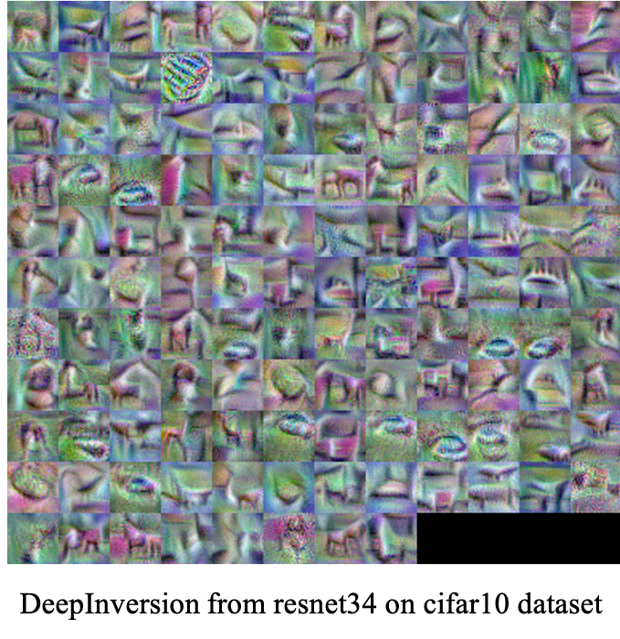

# Dreaming to Distill: Data free Knowledge Transfer via DeepInversion Tensorflow Keras

<p align="center">
	
</p>

## Requirements

- Tensorflow 2.3.0 
- Python 3.6


## Running the code

### ImageNet

The following code generates DeepInversion images by using pretrained resnet50v2 model. 

```shell
CUDA_VISIBLE_DEVICES=0 python gen_DI.py --dataset=imagenet --t_model_path=resnet50v2 --adi_coeff=0.0 --bs=32 --n_iters=3000 --lr=0.02 --jitter=30
```

Arguments:

- `dataset` - Select a dataset ['imagenet']
	- I will update some codes for cifar10 and cifar100 datasets.
- `t_model_path` - teacher model path
	- Available list of teacher models: ['resnet50v2', 'mobilenet', 'mobilenetv2', 'vgg19']
- `adi_coeff` - Coefficient for Adaptive Deep Inversion
- `s_model_path` - Student model path
- `n_iters` - iterations
- `bs` - Batch size
- `jitter` - jittering factor
- `r_feature` - Coefficient for feature distribution regularization
- `first_bn_mul` - Additional multiplier on first bn layer of R_feature
- `tv_l1` - Coefficient for total variation L1 loss
- `tv_l2` - Coefficient for total variation L2 loss
- `lr` - Learning rate
- `l2` - L2 loss on the image
- `main_mul` - Coefficient for the main loss in optimization
- `random_label` - Generate random label??
- `save_path` - Saved directory path
- `epochs` - if you try to train a student network, set more than 1
	- default is 1


### cifar10 and cifar100


#### train teacher network from raw dataset
Before you generate DeepInversion, you need to train a teacher model for cifar10(or 100) dataset. For this, run the following scripts: 

```shell
CUDA_VISIBLE_DEVICES=0 python train_teacher.py --dataset=cifar10 --model_name=resnet34 --batch_size=128
```

#### generate DeepInversion
Then, you can find the teacher network in **saved_models** folder.  
Generate DeepInversion from teacher network (suppose you select teacher as resnet34 on cifar10 dataset):

```shell
CUDA_VISIBLE_DEVICES=0 python gen_DI.py --dataset=cifar10 --t_model_path=saved_models/cifar10_resnet34.h5 --adi_coeff=0.0 --bs=256 --r_feature=0.02 --jitter=2  --epochs=150
```
<p align="center">
	
</p>


#### train studen network from DeepInversion using knowledge distillation

```shell
CUDA_VISIBLE_DEVICES=0 python train_student.py --dataset=cifar10 --teacher_path=./saved_models/cifar10_resnet34.h5 --student_name=resnet18 --batch_size=256
```

Then, you can get stduent network in **saved_models** folder.


## Understanding this paper

Check my blog!!
[Here](https://da2so.github.io/2020-08-18-Dreaming_to_Distill_Data-free_Knowledge_Transfer_via_DeepInversion/)